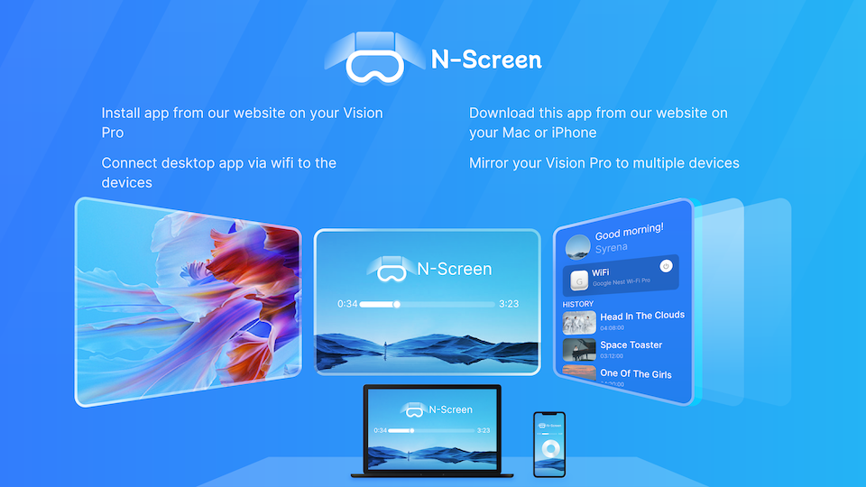
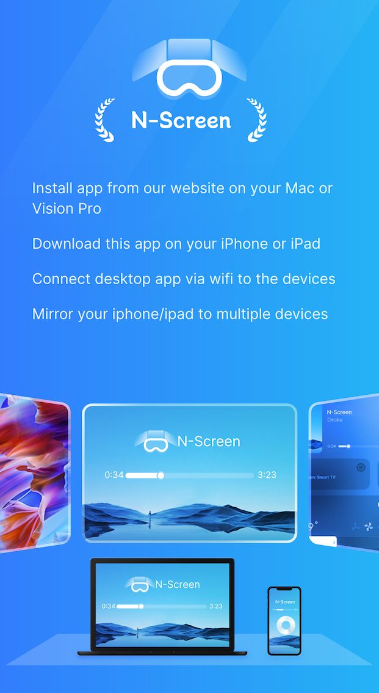
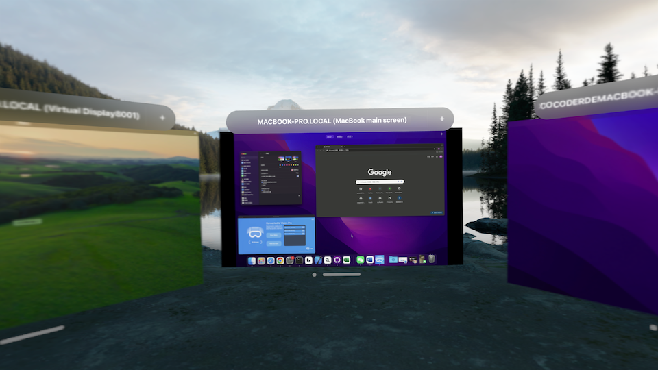
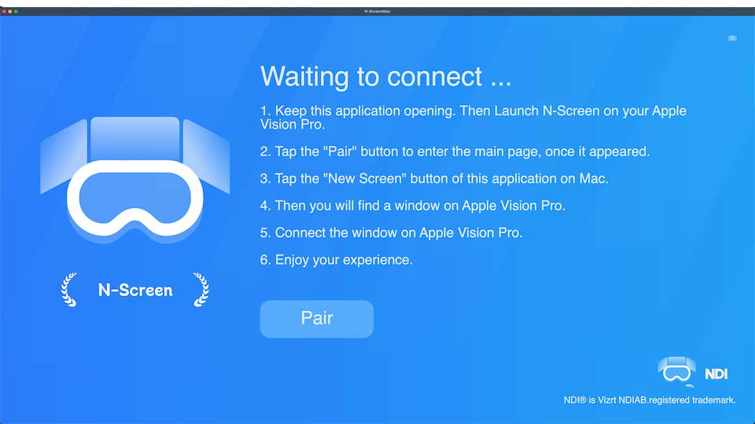

# N-ScreenInfomation

## 👋 Welcome to N-Screen!

Here is our Official website: [【传送门】](https://n-screen-web.vercel.app/)
                

Our vision is that the screen is no longer limited by the device. You can use N-Screen to wirelessly connect all Mac, iOS, iPad, Windows PC, Android and even cameras and other devices, and synchronize their screens to the unlimited windows of Vision Pro!
                
At present, we have completed some functions of Vision pro, Mac and iOS, and the apps for windows and android are still under development, so stay tuned! 😀
                
## 😭 TODO：

1.Resolution and frame rate manual selection.
2.Mac app window separate collection.
3.More friendly interaction method.

## User's Guide

 If you want to cast multiple desktops on Mac to Vision Pro, you need to download our N-Screen APP on Mac. After installation, it will automatically link with Vision Pro. After the link is successful, you can create multiple desktops on Mac. screen, you can now create multiple windows on Vision Pro to accept them.

Here's the Mac download address: [N-Screen on GitHub](https://github.com/FTVisionProTechnology/N-ScreenInfomation/releases/tag/V1.0)
                
If you want to cast your iPhone/iPad screen to Vision pro, you only need to search for N-Screen on its app store and download it.

## Copyright

- NDI is Vizrt NDI AB. registered trademark.

## Privacy Policy

- N/A
- App does not collect any information. Have Fun!

## Preview

iPhone Preview

Vision pro Preview

Mac preview

